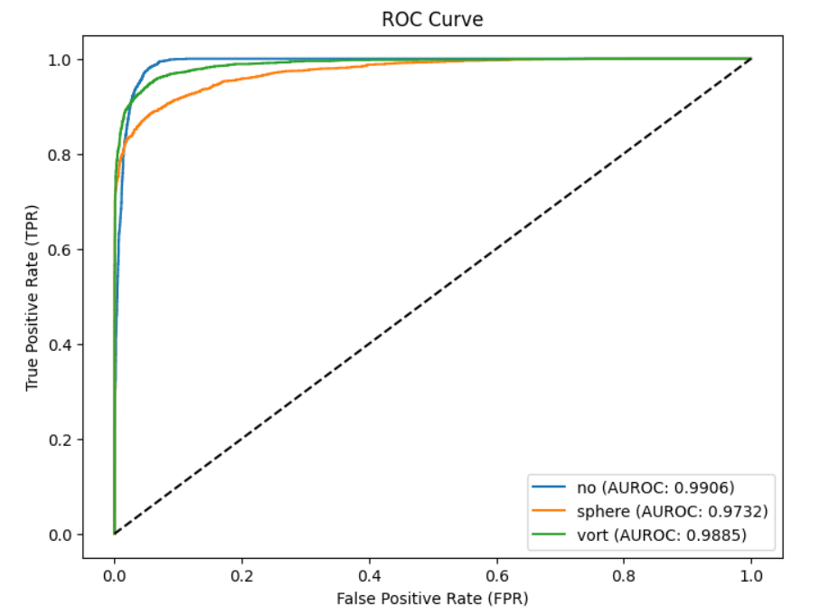

# Common Test I. Multi-Class Classification


**Task:** Build a model for classifying the images into lenses using PyTorch or Keras. Pick the most appropriate approach and discuss your strategy.


## Training
I have utilized ResNet-18 for feature extraction and FC layers for classification purposes. The model was trained for 25 epochs on 80:10:10 split of given data for training, validation and testing.
The hyper parameters of the model were tuned based on validation performance of the model.

AdamW optimizer is used to train the given model with learning rate of 4 x 10^-4 and weight decay of 1 x 10^-3. 

**torchmetrics** ( https://pypi.org/project/torchmetrics/ ) library was used to evaluate all metrics to ensure consistency and accuracy of implementation.

## Results

| Metric | Value |
|--|--|
| AUROC | 0.9841 |

**Per Class AUROC Scores**

| Class | AUROC |
|--|--|
| no | 0.9906 |
| sphere | 0.9732 |
| vort | 0.9885 |

<br>




## Note
**Trained Model Weights** can be found in this directory, to evaluate the performance of trained model kindly use following code snippet:

```
import torch  

device = torch.device("cuda" if torch.cuda.is_available() else "cpu")

## Please replace this comment with model class from the notebook here

model_path = "<path_to_trained_weights>"

model = torch.load(model_path, map_location=device)

model.eval()
```