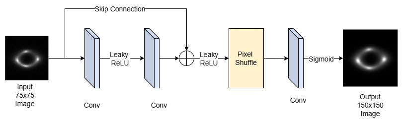

# Specific Test III. Image Super-resolution (Task III.A)

**Task III.A :** Train a deep learning-based super resolution algorithm of your choice to upscale low-resolution strong lensing images using the provided high-resolution samples as ground truths. Please implement your approach in PyTorch or Keras and discuss your strategy.

**torchmetrics** ( https://pypi.org/project/torchmetrics/ ) library was used to evaluate all metrics to ensure consistency and accuracy of implementation.

## Model
The model is inspired from SRGAN but instead of SRGAN setting, I have chosen WGAN with gradient penalty (WGAN-GP) for its training stability. 

The critic is a standard convolution neural network which has two parts, feature extractor and dense layers.

The generator is based on SRGAN. I have used pixel-shuffle for its compute efficiency and to avoid artifacts in the image.

### Generator Block Diagram

## Results

| Metric | Value |
|--|--|
| PSNR | 36.2030 |
| SSIM | 0.9133 |
| MSE | 0.0002 |

