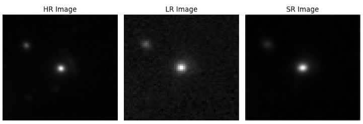

# Specific Test III. Image Super-resolution (Task III.B)

**Task III.B:** Train a deep learning-based super-resolution algorithm of your choice to enhance low-resolution strong lensing images using a limited dataset of real HR/LR pairs collected from HSC and HST telescopes. You can adapt and fine-tune your super-resolution model from Task III.A. or use any other approach, such as few-shot learning strategies, transfer learning, domain adaptation, or data augmentation techniques, etc. Please implement your approach in PyTorch or Keras and discuss your strategy.

**torchmetrics** ( https://pypi.org/project/torchmetrics/ ) library was used to evaluate all metrics to ensure consistency and accuracy of implementation.

For this task I have used fine-tuning technique. Fine tuning allows utilization of the knowledge gained from pervious task to perform current task. This approach suites well for the nature of the task where amount of data is relatively low and where there is risk of over fitting on training data.

## Results

| Metric | Value |
|--|--|
| PSNR | 31.3010 |
| SSIM | 0.8537 |
| MSE | 0.0008 |

